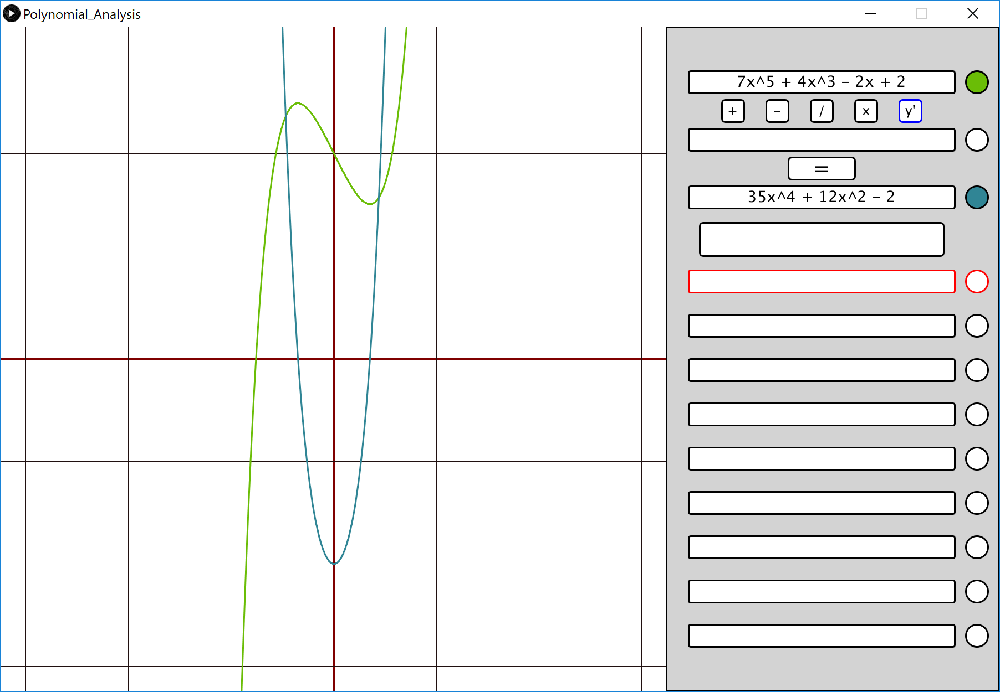

# Polynomial-Analysis

A very basic grapher for polynomial functions. With the ability to add, subtract, multiply, divide, and find derivatives of said functions. Made using processing with a beautiful and user friendly interface.

## Requirements

* Processing (version 3 or newer)

## Installing

Simply open "Polynomial_Analysis.pde" in the "Polynomial_Analysis" folder through Processing and run.

## Controls

* Backspace to delete character
* Delete key to delete entire function
* Enter key to confirm input is complete
* Selection is hightlighted in red
* Mouse wheel to zoom in or zoom out
* Tab key to change the color of the function
* Graph has scale of 1 (each box grid is 1 unit)

## Screenshots

## Built With

* Processing

## Author(s)

* Bob Huang
* Lyndon Tang
* Jaedon Cheung
